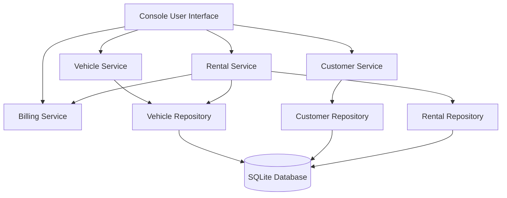
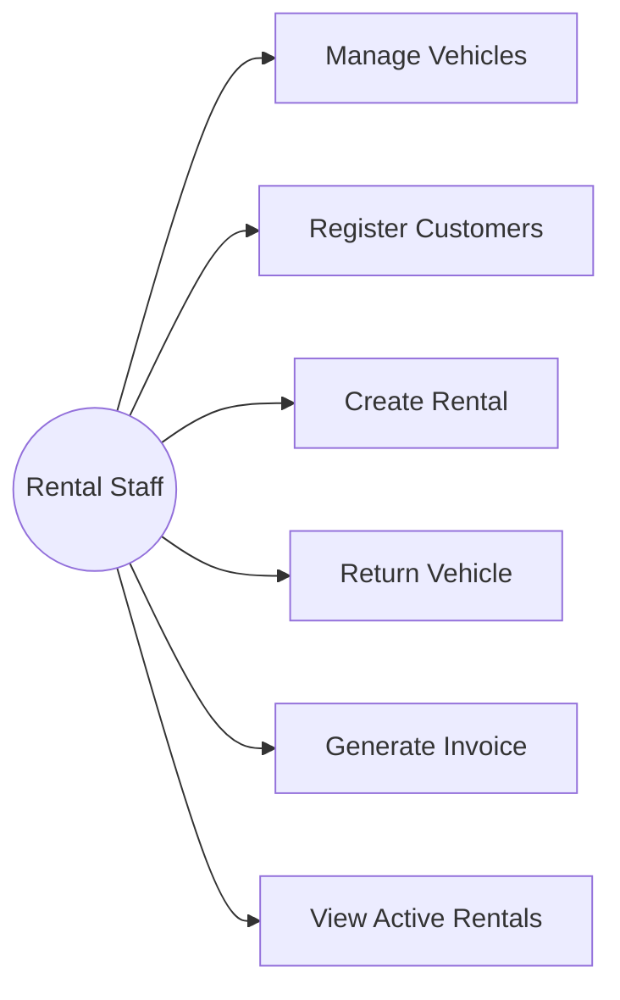
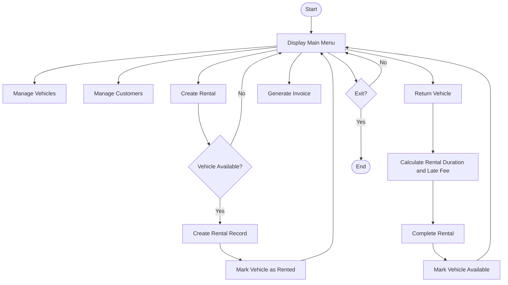
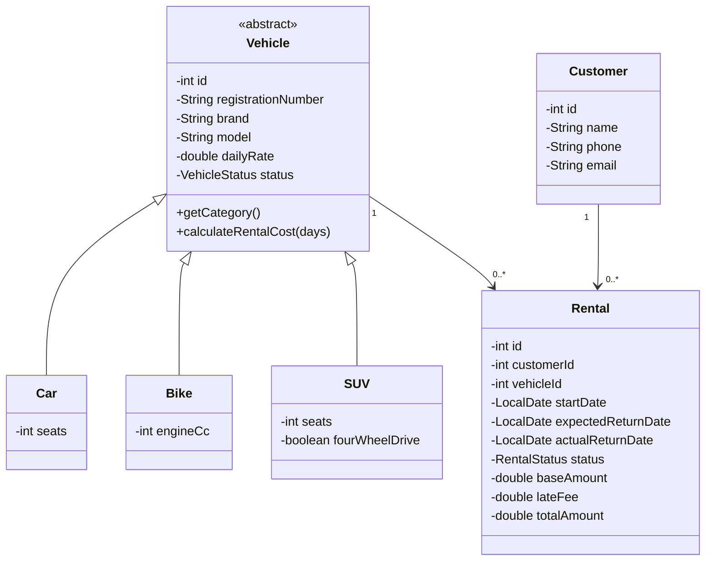
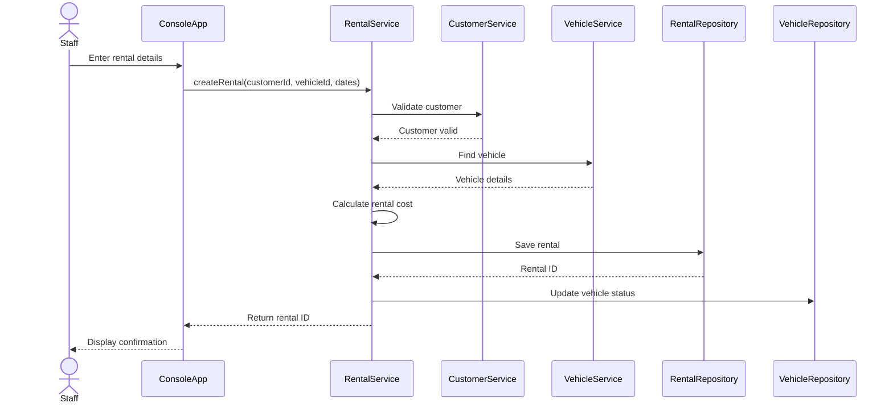
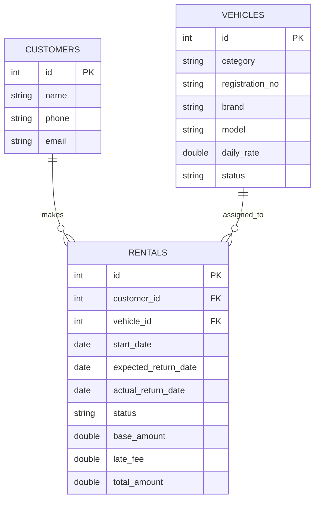

# Design Diagrams

## System Architecture

```mermaid
flowchart TD
    UI[Console User Interface] --> VS[Vehicle Service]
    UI --> CS[Customer Service]
    UI --> RS[Rental Service]
    UI --> BS[Billing Service]

    VS --> VR[Vehicle Repository]
    CS --> CR[Customer Repository]
    RS --> RR[Rental Repository]
    RS --> VR
    RS --> BS

    VR --> DB[(SQLite Database)]
    CR --> DB
    RR --> DB
```

## Use Case Diagram

```mermaid
flowchart LR
    Admin((Rental Staff))

    Admin --> A[Manage Vehicles]
    Admin --> B[Register Customers]
    Admin --> C[Create Rental]
    Admin --> D[Return Vehicle]
    Admin --> E[Generate Invoice]
    Admin --> F[View Active Rentals]
```

## Workflow Diagram

```mermaid
flowchart TD
    Start([Start]) --> Menu[Display Main Menu]
    Menu --> Vehicle[Manage Vehicles]
    Menu --> Customer[Manage Customers]
    Menu --> Rental[Create Rental]
    Menu --> Return[Return Vehicle]
    Menu --> Invoice[Generate Invoice]

    Rental --> Check{Vehicle Available?}
    Check -- No --> Menu
    Check -- Yes --> Create[Create Rental Record]
    Create --> Mark[Mark Vehicle as Rented]
    Mark --> Menu

    Return --> Calculate[Calculate Rental Duration and Late Fee]
    Calculate --> Complete[Complete Rental]
    Complete --> Available[Mark Vehicle Available]
    Available --> Menu

    Menu --> Exit{Exit?}
    Exit -- Yes --> End([End])
    Exit -- No --> Menu
```

## Class Diagram

```mermaid
classDiagram
    class Vehicle {
        <<abstract>>
        -int id
        -String registrationNumber
        -String brand
        -String model
        -double dailyRate
        -VehicleStatus status
        +getCategory()
        +calculateRentalCost(days)
    }

    class Car {
        -int seats
    }

    class Bike {
        -int engineCc
    }

    class SUV {
        -int seats
        -boolean fourWheelDrive
    }

    Vehicle <|-- Car
    Vehicle <|-- Bike
    Vehicle <|-- SUV

    class Customer {
        -int id
        -String name
        -String phone
        -String email
    }

    class Rental {
        -int id
        -int customerId
        -int vehicleId
        -LocalDate startDate
        -LocalDate expectedReturnDate
        -LocalDate actualReturnDate
        -RentalStatus status
        -double baseAmount
        -double lateFee
        -double totalAmount
    }

    Customer "1" --> "0..*" Rental
    Vehicle "1" --> "0..*" Rental
```

## Sequence Diagram: Create Rental

```mermaid
sequenceDiagram
    actor Staff
    participant UI as ConsoleApp
    participant RS as RentalService
    participant CS as CustomerService
    participant VS as VehicleService
    participant RR as RentalRepository
    participant VR as VehicleRepository

    Staff->>UI: Enter rental details
    UI->>RS: createRental(customerId, vehicleId, dates)
    RS->>CS: Validate customer
    CS-->>RS: Customer valid
    RS->>VS: Find vehicle
    VS-->>RS: Vehicle details
    RS->>RS: Calculate rental cost
    RS->>RR: Save rental
    RR-->>RS: Rental ID
    RS->>VR: Update vehicle status
    RS-->>UI: Return rental ID
    UI-->>Staff: Display confirmation
```

## ER Diagram

```mermaid
erDiagram
    CUSTOMERS ||--o{ RENTALS : makes
    VEHICLES ||--o{ RENTALS : assigned_to

    CUSTOMERS {
        int id PK
        string name
        string phone
        string email
    }

    VEHICLES {
        int id PK
        string category
        string registration_no
        string brand
        string model
        double daily_rate
        string status
    }

    RENTALS {
        int id PK
        int customer_id FK
        int vehicle_id FK
        date start_date
        date expected_return_date
        date actual_return_date
        string status
        double base_amount
        double late_fee
        double total_amount
    }
```
